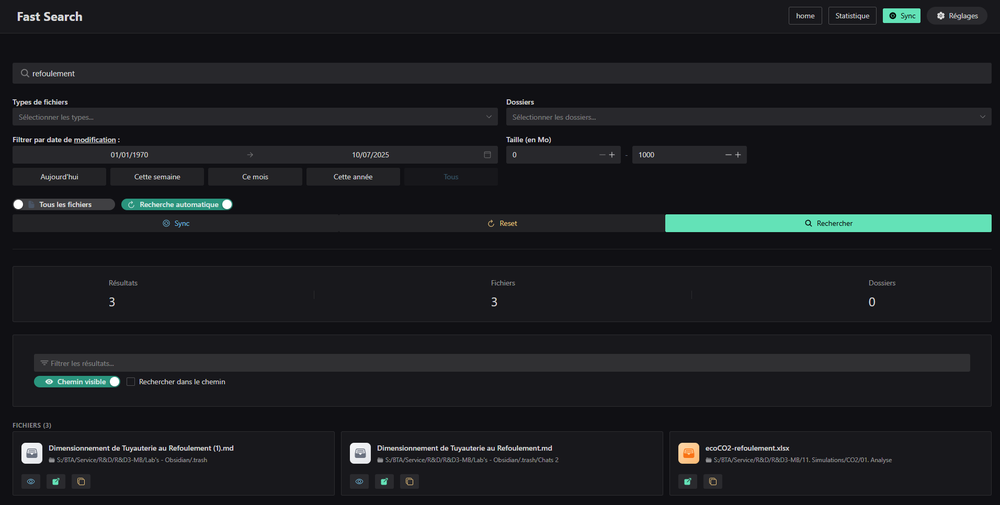
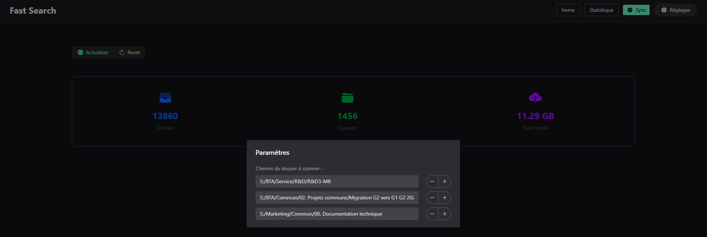
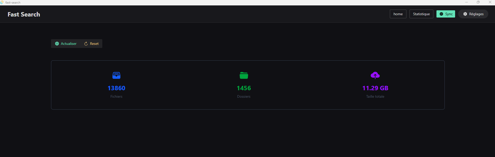

# Fast Search

Une application de recherche rapide de fichiers construite avec Tauri, Vue.js 3 et Rust, avec intégration d'IA pour des recherches intelligentes.

## Screenshots







## Fonctionnalités

- 🔍 **Recherche avancée** : Recherche de fichiers et dossiers avec filtres par type
- 🤖 **Recherche IA** : Recherche en langage naturel avec LM Studio
- 📊 **Statistiques en temps réel** : Vue d'ensemble des fichiers indexés
- 🎯 **Interface moderne** : UI élégante avec Naive UI et Tailwind CSS
- ⚡ **Performance optimisée** : Backend Rust pour des performances maximales
- 💾 **Base de données SQLite** : Persistance des données d'indexation
- 🔄 **Synchronisation** : Indexation automatique des dossiers sélectionnés
- 📁 **Navigation** : Ouverture des fichiers dans l'explorateur système
- 🎨 **Design responsive** : Interface adaptée à tous les écrans
- 👁️ **Prévisualisation** : Aperçu des images et documents
- ⚙️ **Paramètres** : Configuration des chemins de recherche
- 📋 **Copie de chemin** : Copie rapide des chemins dans le presse-papiers
- 🔄 **Pagination** : Chargement progressif des résultats
- 📄 **Indexation de contenu** : Recherche dans le contenu des fichiers (PDF, TXT, CSV, etc.)
- 📤 **Export CSV** : Export des résultats de recherche en format CSV
- 🌙 **Thèmes** : Support des thèmes sombre/clair

## Technologies utilisées

### Frontend
- **Vue.js 3** - Framework JavaScript progressif
- **TypeScript** - Typage statique
- **Naive UI** - Composants UI modernes
- **Tailwind CSS** - Framework CSS utilitaire
- **Pinia** - Gestion d'état
- **Vue Router** - Routage côté client
- **Vite** - Build tool rapide
- **VueUse** - Utilitaires Vue.js
- **Vicons** - Icônes modernes
- **Luxon** - Gestion des dates

### Backend
- **Rust** - Langage système performant
- **Tauri 2** - Framework pour applications desktop
- **SQLite** - Base de données légère
- **Rusqlite** - Driver SQLite pour Rust
- **Walkdir** - Parcours de répertoires
- **Chrono** - Gestion des dates
- **Serde** - Sérialisation/désérialisation
- **Rayon** - Parallélisation
- **Tokio** - Runtime asynchrone
- **Reqwest** - Client HTTP
- **Lopdf** - Lecture de fichiers PDF

## Installation

### Prérequis

- **Node.js** (version 18 ou supérieure)
- **Rust** (dernière version stable)
- **Tauri CLI** : `npm install -g @tauri-apps/cli`

### Installation des dépendances

```bash
# Cloner le repository
git clone https://github.com/math-dev-24/fast-search.git
cd fast-search

# Installer les dépendances frontend
npm install

# Installer les dépendances Rust
cd src-tauri
cargo build
cd ..
```

## Utilisation

### Développement

```bash
# Lancer l'application en mode développement
npm run tauri dev
```

### Production

```bash
# Construire l'application
npm run tauri build
```

## Guide d'utilisation

### 1. Synchronisation des dossiers

1. Cliquez sur "Synchroniser" dans l'interface
2. Sélectionnez un ou plusieurs dossiers à indexer
3. L'application scanne récursivement tous les fichiers et dossiers
4. Les données sont stockées dans la base SQLite locale

### 2. Recherche de fichiers

#### Recherche classique
1. Utilisez la barre de recherche pour trouver des fichiers
2. Filtrez par type de fichier (optionnel)
3. Choisissez de rechercher dans les dossiers ou fichiers
4. Les résultats s'affichent en temps réel avec pagination

#### Recherche IA
1. Basculez vers le mode "AI Search"
2. Décrivez votre recherche en langage naturel
3. Sélectionnez un modèle IA disponible
4. L'IA génère automatiquement les filtres de recherche

### 3. Indexation de contenu

1. Activez l'indexation de contenu dans les paramètres
2. L'application indexe automatiquement le contenu des fichiers supportés
3. Recherchez dans le contenu des fichiers PDF, TXT, CSV, etc.

### 4. Navigation et actions

- **Fichiers** : Double-cliquez pour ouvrir dans l'application par défaut
- **Dossiers** : Double-cliquez pour ouvrir dans l'explorateur
- **Prévisualisation** : Cliquez sur l'icône d'œil pour prévisualiser
- **Copie de chemin** : Utilisez le bouton de copie pour copier le chemin
- **Export CSV** : Exportez les résultats de recherche
- **Statistiques** : Consultez les métriques d'indexation

### 5. Paramètres

- Accédez aux paramètres via l'icône d'engrenage
- Configurez les chemins de recherche par défaut
- Personnalisez l'affichage des chemins
- Activez/désactivez l'indexation de contenu

## Architecture

### Frontend (Vue.js 3)

```
src/
├── components/          # Composants réutilisables
│   ├── base/           # Composants de base
│   │   └── Header.vue  # En-tête de l'application
│   ├── card/           # Cartes d'affichage
│   │   ├── File.vue    # Carte d'affichage des fichiers
│   │   └── Folder.vue  # Carte d'affichage des dossiers
│   ├── sync/           # Composants de synchronisation
│   │   ├── Details.vue # Détails de synchronisation
│   │   └── Indicator.vue # Indicateur de progression
│   ├── ColorMode.vue   # Gestion des thèmes
│   ├── FileDetail.vue  # Détails des fichiers
│   ├── Filter.vue      # Composant de filtrage
│   ├── Search.vue      # Barre de recherche classique
│   ├── SearchWithAI.vue # Recherche IA
│   └── Setting.vue     # Paramètres
├── views/              # Pages de l'application
│   ├── Home.vue        # Page principale
│   └── Statistique.vue # Page des statistiques
├── composables/        # Composables Vue
│   ├── useDate.ts      # Utilitaires de date
│   └── useSync.ts      # Gestion de la synchronisation
├── shared/             # Code partagé
│   ├── store/          # Stores Pinia
│   │   └── searchStore.ts   # Store de recherche
│   ├── pathFormat.ts   # Utilitaires de formatage
│   └── sizeFormat.ts    # Formatage des tailles
├── types/              # Types TypeScript
│   ├── file.ts         # Interface File
│   ├── searchStore.ts       # Types de recherche
│   ├── setting.ts      # Interface Setting
│   └── stat.ts         # Interface Stat
└── route.ts            # Configuration du routage
```

### Backend (Rust + Tauri 2)

```
src-tauri/src/
├── lib.rs              # Point d'entrée et commandes Tauri
├── entities/           # Modèles de données
│   ├── ai.rs           # Entités IA
│   ├── file.rs         # Entité File
│   ├── search.rs       # Types de recherche
│   └── stat.rs         # Entité Stat
├── adapters/           # Couche d'accès aux données
│   ├── ai/             # Adaptateurs IA
│   │   └── lm_studio.rs # Intégration LM Studio
│   ├── reader/         # Lecteurs de fichiers
│   │   ├── code_reader.rs # Lecture de fichiers de code
│   │   ├── csv_reader.rs  # Lecture de fichiers CSV
│   │   ├── pdf_reader.rs  # Lecture de fichiers PDF
│   │   ├── text_reader.rs # Lecture de fichiers texte
│   │   └── word_reader.rs # Lecture de fichiers Word
│   └── repository/     # Implémentations des repositories
│       └── sqlite.rs   # Repository SQLite
├── services/           # Logique métier
│   ├── ai_service.rs   # Service IA
│   ├── content_indexer_service.rs # Service d'indexation de contenu
│   ├── file_service.rs # Service de gestion des fichiers
│   └── reader_service.rs # Service de lecture de fichiers
├── ports/              # Interfaces (traits)
│   ├── ai.rs           # Interface IA
│   ├── reader.rs       # Interface Reader
│   └── repository.rs   # Interface Repository
└── utils/              # Utilitaires
    ├── ai.rs           # Utilitaires IA
    ├── collect.rs      # Collecte de fichiers
    ├── events.rs       # Gestion des événements
    ├── file.rs         # Utilitaires de fichiers
    ├── generator.rs    # Génération des services
    ├── indexer.rs      # Indexation de contenu
    └── scan.rs         # Scanner de fichiers
```

## API Backend

### Commandes Tauri disponibles

#### Gestion des fichiers
- `get_stat()` - Récupère les statistiques globales
- `get_current_dir()` - Récupère le répertoire courant
- `sync_files_and_folders(paths: Vec<String>)` - Synchronise plusieurs dossiers
- `search_files(query: SearchQuery)` - Recherche de fichiers
- `get_type_files()` - Liste des types de fichiers
- `open_file(path: String)` - Ouvre un fichier dans l'explorateur
- `reset_data()` - Réinitialise la base de données
- `get_all_folders()` - Récupère tous les dossiers
- `get_all_paths()` - Récupère tous les chemins configurés
- `save_paths(paths: Vec<String>)` - Sauvegarde les chemins de recherche

#### Indexation de contenu
- `start_content_indexing()` - Démarre l'indexation du contenu des fichiers
- `get_uncontent_indexed_files()` - Récupère les fichiers non indexés

#### Recherche IA
- `ai_search(natural_query: String, model: String)` - Recherche IA
- `ai_health_check(model: String)` - Vérification de santé de l'IA
- `ai_list_models()` - Liste des modèles IA disponibles

#### Diagnostic
- `diagnose_scan_issues()` - Diagnostic des problèmes de scan

## Fonctionnalités avancées

### Recherche IA

L'application intègre LM Studio pour des recherches en langage naturel :

- **Modèles locaux** : Utilise des modèles IA locaux via LM Studio
- **Recherche naturelle** : Décrivez votre recherche en français
- **Filtres automatiques** : L'IA génère automatiquement les filtres appropriés
- **Configuration** : URL et modèle configurables

### Indexation de contenu

Support de lecture et d'indexation du contenu de nombreux types de fichiers :

#### Fichiers texte
- **TXT, MD, JSON, LOG** : Lecture directe
- **Code source** : JS, TS, Python, Java, C++, Rust, etc.
- **Configuration** : INI, CFG, CONF, YAML, TOML

#### Documents
- **PDF** : Extraction de texte avec lopdf
- **CSV** : Parsing et indexation des données
- **Word** : Support prévu (en développement)

#### Limites
- **Taille maximale** : 10-50MB selon le type
- **Lignes maximales** : 1000-5000 selon le type
- **Contenu maximal** : 50KB par fichier

### Prévisualisation de fichiers

L'application supporte la prévisualisation de plusieurs types de fichiers :
- **Images** : JPG, PNG, GIF, WebP, SVG
- **Documents** : PDF (en développement)
- **Fichiers texte** : TXT, MD, JSON, XML, CSV, LOG, INI, CONF, CFG

### Export des résultats

- **Format CSV** : Export complet avec métadonnées
- **Encodage UTF-8** : Support des caractères spéciaux
- **Nommage automatique** : Date et heure dans le nom de fichier

### Gestion des paramètres

- Configuration des chemins de recherche par défaut
- Personnalisation de l'affichage
- Sauvegarde des préférences utilisateur
- Gestion des thèmes sombre/clair

### Interface utilisateur

- **Design responsive** : Adapté à tous les écrans
- **Pagination intelligente** : Chargement progressif des résultats
- **Filtres avancés** : Par type, taille, date, contenu
- **Recherche en temps réel** : Résultats instantanés
- **Navigation intuitive** : Actions contextuelles
- **Thèmes** : Support sombre/clair

## Configuration IA

### LM Studio

L'application utilise LM Studio pour les recherches IA :

1. **Installation** : Téléchargez LM Studio depuis [lmstudio.ai](https://lmstudio.ai)
2. **Modèles** : Téléchargez des modèles compatibles (Llama, Mistral, etc.)
3. **Configuration** : Modifiez `LOCAL_URL_AI` dans `src-tauri/src/lib.rs`
4. **Démarrage** : Lancez LM Studio et démarrez un serveur local

### Prompt d'IA

Le système utilise un prompt spécialisé pour convertir les requêtes naturelles en filtres de recherche :

```text
Tu es un assistant qui convertit des requêtes en langage naturel en filtres de recherche de fichiers.

Tu DOIS retourner UNIQUEMENT un objet JSON valide correspondant à cette structure :
{
    "text": "terme de recherche",
    "filters": {
        "is_dir": false,
        "folders": [],
        "file_types": [],
        "size_limit": [0, 1000],
        "date_range": [0, timestamp_fin],
        "date_mode": "Create" | "Modify",
        "search_in_content": false
    },
    "sort_by": "Name" | "Size" | "LastModified",
    "sort_order": "Asc" | "Desc",
    "limit": 1000,
    "offset": 0
}
```

## Résolution des problèmes

### Problèmes courants

1. **Chemin invalide**
   - Vérifiez que le chemin existe et est accessible
   - Utilisez des chemins absolus (ex: `C:\Users\Documents`)

2. **Permissions insuffisantes**
   - L'application peut ne pas avoir accès aux dossiers système
   - Évitez les dossiers protégés comme `C:\Windows`

3. **Base de données verrouillée**
   - Fermez l'application et relancez-la
   - Supprimez le fichier `db.sqlite` pour repartir de zéro

4. **Erreurs de compilation Rust**
   - Vérifiez que Rust est à jour : `rustup update`
   - Nettoyez le cache : `cargo clean`

5. **Problèmes de prévisualisation**
   - Vérifiez que les fichiers sont accessibles
   - Certains types de fichiers peuvent ne pas être supportés

6. **Problèmes d'IA**
   - Vérifiez que LM Studio est démarré
   - Vérifiez l'URL de connexion dans le code
   - Vérifiez que le modèle sélectionné est disponible

7. **Indexation de contenu lente**
   - L'indexation peut prendre du temps pour de gros fichiers
   - Vérifiez les logs pour les erreurs de lecture
   - Certains fichiers peuvent être trop volumineux

### Logs et débogage

- **Développement** : Console du navigateur (F12)
- **Production** : Console de l'application
- **Rust** : Logs dans la console de développement
- **IA** : Logs détaillés dans la console Rust

## Développement

### Ajouter une nouvelle fonctionnalité

1. **Backend** : Ajoutez la commande dans `src-tauri/src/lib.rs`
2. **Frontend** : Créez l'interface dans `src/views/`
3. **Types** : Définissez les types dans `src/types/`
4. **Store** : Ajoutez la logique dans `src/shared/store/`

### Tests

```bash
# Tests Rust
cd src-tauri
cargo test

# Tests frontend (si configurés)
npm run test
```

### Scripts disponibles

```bash
npm run dev          # Développement frontend uniquement
npm run build        # Build frontend
npm run preview      # Prévisualisation du build
npm run tauri dev    # Développement complet
npm run tauri build  # Build production
```

## Contribution

1. Fork le projet
2. Créez une branche pour votre fonctionnalité
3. Committez vos changements
4. Poussez vers la branche
5. Ouvrez une Pull Request

## Roadmap

### Fonctionnalités complétées ✅
- [X] Stocker les paths à traiter côté Rust
- [X] Filtres avancés par poids, date de création/modification
- [X] Export des résultats de recherche (CSV)
- [X] Thèmes sombre/clair
- [X] Recherche dans le contenu des fichiers
- [X] Indexation en arrière-plan
- [X] Progress bar avancement traitement des fichiers
- [X] Recherche IA avec LM Studio
- [X] Indexation de contenu (PDF, TXT, CSV, Code)
- [X] Interface de recherche IA
- [X] Gestion des modèles IA
- [X] Diagnostic des problèmes de scan

### Fonctionnalités en cours 🔄
- [ ] Historique des recherches - enregistrer une config
  - [ ] Table history/config
  - [ ] Front save config
  - [ ] Slide avec liste des configs
- [ ] Détection automatique de nouveaux fichiers
- [ ] Prévisualiser les fichiers (PDF, Word, image, ...)
- [ ] Raccourcis clavier
- [ ] Indexation lors d'un nouveau fichier

### Améliorations techniques
- [ ] Tests unitaires et d'intégration
- [ ] Optimisation des performances
- [ ] Support de plus de formats de fichiers
- [ ] Amélioration de l'interface utilisateur
- [ ] Documentation API complète

## Licence

MIT License - voir le fichier LICENSE pour plus de détails.
